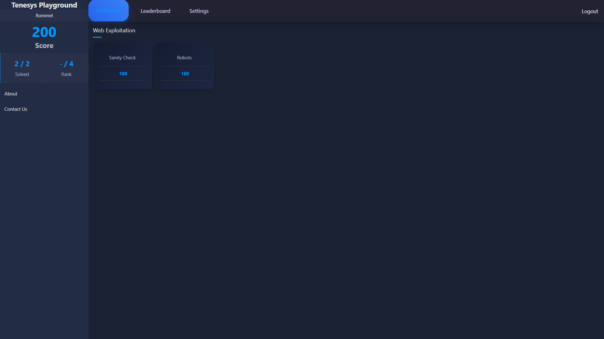
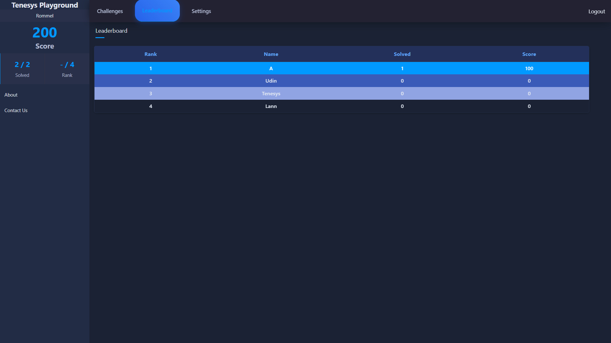

# Tenesys Playground

Tenesys Playground is a web-based Capture The Flag (CTF) platform built with PHP.  
This project is originally based on [anton-ctf-php](https://github.com/haxzie-xx/anton-ctf-php), but the design and interface have been upgraded and improved for a better user experience.

## Features

- User registration and login
- Challenge submission system
- Scoreboard and ranking system
- Smooth and modern UI with animations

## Improvements from Original

Compared to the original repository, this version includes:

- Complete UI/UX redesign
- Enhanced responsiveness
- Animation transitions
- New color scheme and layouts

## Screenshots

## How to Run

1. Clone the repository

   git clone https://github.com/Romm31/Tenesys-Playground.git

2. Set up your PHP environment (e.g., XAMPP, Laragon, etc.)

3. Import the database file if available (usually named db.sql)

4. Start your local server and access the site via localhost

## Credits

- Based on anton-ctf-php by haxzie-xx [anton-ctf-php](https://github.com/haxzie-xx/anton-ctf-php)
- Modified and improved by [Rommel](https://github.com/Romm31)
